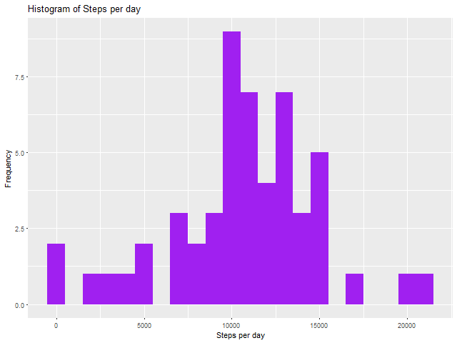
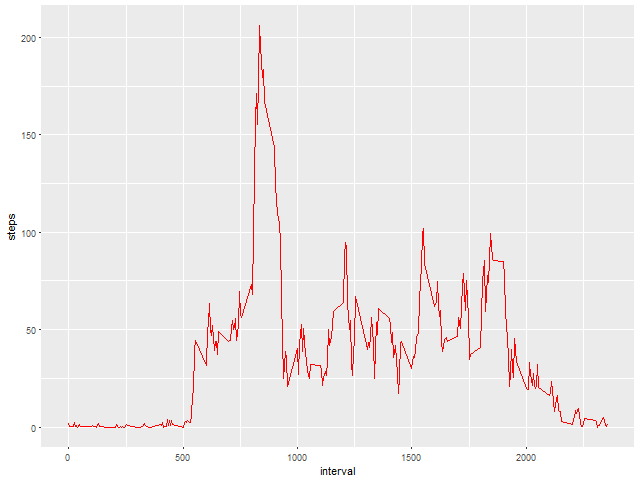
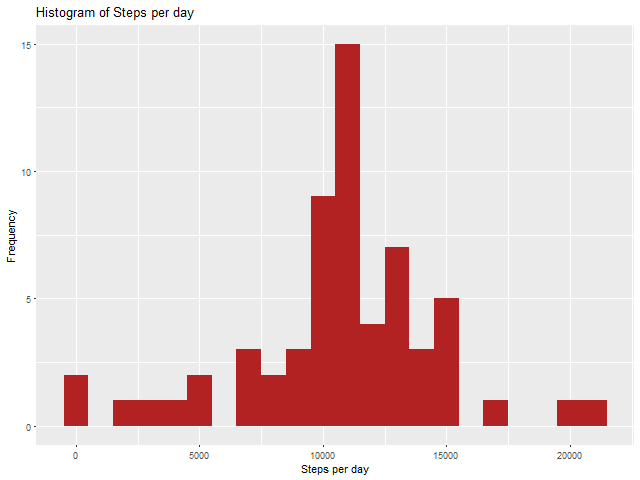
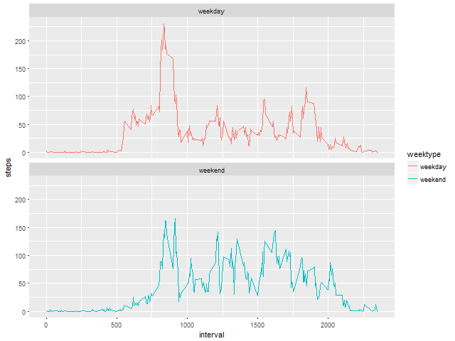

```{r setup, include=FALSE}
knitr::opts_chunk$set(echo = TRUE)
```

## Introduction

This assignment makes use of data from a personal activity monitoring device. This device collects data at 5 minute intervals throughout the day. The data consists of two months of data from an anonymous individual collected during the months of October and November, 2012 and include the number of steps taken in 5 minute intervals each day.

This document presents the results from Project Assignment 1 in the Coursera course Reproducible Research, written in a single R markdown document that can be processed by knitr and transformed into an HTML file.

## R preparations
In this document code will be represented to show how the results have been achieved. Set the default of echo to be true throughout the document:

```{r}
library(knitr)
opts_chunk$set(echo = TRUE)
```
## Load in the necessary libraries and set working directory
```{r}
library(lubridate)
library(ggplot2)
library(dplyr)
```

## Loading and preprocessing the data
Download and Load the data (i.e. read.csv())
Process/transform the data (if necessary) into a format suitable for analysis

```{r}
temp_file <- tempfile()
download.file("https://d396qusza40orc.cloudfront.net/repdata%2Fdata%2Factivity.zip",temp_file)
uncompress_file <- unz(temp_file, "activity.csv")
data_original <- read.csv(uncompress_file, header = TRUE, sep = ',', colClasses = c("numeric", "character","integer"))
unlink(temp_file)
data_original$date <- ymd(data_original$date)
```

Now everything is ready and set up for solving some problems.

## What is mean total number of steps taken per day?
For this part of the assignment the missing values can be ignored.

Calculate the total number of steps taken per day.
Make a histogram of the total number of steps taken each day.
Calculate and report the mean and median of the total number of steps taken per day.

### Methodology and Result

1. Calculate the total number of steps per day using aggregate and group by date:

```{r}
data <- data_original[!(is.na(data_original$steps)),]
steps <- aggregate(data$steps, by=list(date=data$date), FUN=sum)
names(steps)<-c("date","steps")
```

Check the data with head() and str():

```{r}
head(data)
str(data)
```
## Generate Histogram plots

2. Use ggplot for making the histogram:

```{r}
png("plot1.png", width=640, height=480)
ggplot(steps, aes(x = steps)) +
  geom_histogram(fill = "purple", binwidth = 1000) +
  labs(title = "Histogram of Steps per day", x = "Steps per day", y = "Frequency")
dev.off()
```
### histogram of the total number of steps taken each day




3. Calculate the mean and median of the total number of steps taken per day:

```{r}
mean(steps$steps)
median(steps$steps)
```

Mean steps are 10766 and median steps are 10765.

## What is the average daily activity pattern?
Make a time series plot (i.e. type = "l") of the 5-minute interval (x-axis) and the average number of steps taken, averaged across all days (y-axis).
Which 5-minute interval, on average across all the days in the dataset, contains the maximum number of steps?.

### Methodology and Result

1. Calculate the average number of steps taken in each 5-minute interval per day using dplyr and group by interval:

```{r}
interval <- aggregate(data$steps, by=list(interval=data$interval), FUN=mean)
names(interval)<-c("interval","steps")
```
2. Use ggplot for making the time series of the 5-minute interval and average steps taken:

```{r}
png("plot2.png", width=640, height=480)
ggplot(interval, aes(x=interval, y=steps)) +
  geom_line(color = "red")
dev.off()
```


3. Use which.max() to find out the maximum steps, on average, across all the days:

```{r}
interval[which.max(interval$steps),]
```

The interval 835 has, on average, the highest count of steps, with 206 steps

## Imputing missing values
Note that there are a number of days/intervals where there are missing values (coded as NA). The presence of missing days may introduce bias into some calculations or summaries of the data.

Calculate and report the total number of missing values in the dataset (i.e. the total number of rows with NAs).
Devise a strategy for filling in all of the missing values in the dataset. The strategy does not need to be sophisticated. For example, you could use the mean/median for that day, or the mean for that 5-minute interval, etc.
Create a new dataset that is equal to the original dataset but with the missing data filled in.
Make a histogram of the total number of steps taken each day and calculate and report the mean and median total number of steps taken per day. Do these values differ from the estimates from the first part of the assignment? What is the impact of imputing missing data on the estimates of the total daily number of steps?
### Methodology and Result

1. Summarize all the missing values:
```{r}
sum(is.na(data_original$steps))
```
Missing values are 2304.

2. Let’s take the approach to fill in a missing NA with the average number of steps in the same 5-min interval.
3. Create a new dataset as the original and use tapply for filling in the missing values with the average number of steps per 5-minute interval:
```{r}
data_full <- data_original
nas <- is.na(data_full$steps)
avg_interval <- tapply(data_full$steps, data_full$interval, mean, na.rm=TRUE, simplify=TRUE)
data_full$steps[nas] <- avg_interval[as.character(data_full$interval[nas])]
```
Check that there are no missing values:

```{r}
sum(is.na(data_full$steps))
```
No more missing values.

4. Calculate the number of steps taken in each 5-minute interval per day using aggregate and group by interval:

```{r}
steps_full <- aggregate(data_full$steps, by=list(data_full=data_full$date), FUN=sum)
names(steps_full)<-c("date","steps")
head(steps_full)
```
5. Use ggplot for making the histogram:

```{r}
png("plot3.png", width=640, height=480)
ggplot(steps_full, aes(x = steps)) +
  geom_histogram(fill = "firebrick", binwidth = 1000) +
  labs(title = "Histogram of Steps per day", x = "Steps per day", y = "Frequency")
dev.off()
```


6. Calculate the mean and median steps with the filled in values:

```{r}
mean(steps_full$steps, na.rm = TRUE)
median(steps_full$steps, na.rm = TRUE)
```
The impact of imputing missing data with the average number of steps in the same 5-min interval is that both the mean and the median are equal to the same value: 10766.

## Are there differences in activity patterns between weekdays and weekends?
For this part the weekdays() will come handy. Use the dataset with the filled-in missing values for this part.

1. Create a new factor variable in the dataset with two levels - “weekday” and “weekend” indicating whether a given date is a weekday or weekend day.
2. Make a panel plot containing a time series plot (i.e. type = "l") of the 5-minute interval (x-axis) and the average number of steps taken, averaged across all weekday days or weekend days (y-axis).
### Methodology and Result

1. Use mutate to create a new column, weektype, and apply whether the day is weekend or weekday:

```{r}
data_full <- mutate(data_full, weektype = ifelse(weekdays(data_full$date) == "Saturday" | weekdays(data_full$date) == "Sunday", "weekend", "weekday"))
data_full$weektype <- as.factor(data_full$weektype)
head(data_full)
```

2. Calculate the average steps in the 5-minute interval and use ggplot for making the time series of the 5-minute interval for weekday and weekend, and compare the average steps:

```{r}
interval_full <- aggregate(data_full$steps, by=list(interval=data_full$interval, weektype=data_full$weektype), FUN=mean)
names(interval_full)<-c("interval","weektype","steps")
png("plot4.png", width=640, height=480)
ggplot(interval_full, aes(x=interval, y=steps, color = weektype)) +
  geom_line() +
  facet_wrap(~weektype, ncol = 1, nrow=2)
dev.off()
```


From the two plots it seems that the test object is more active earlier in the day during weekdays compared to weekends, but more active throughout the weekends compared with weekdays (probably because the oject is working during the weekdays, hence moving less during the day).